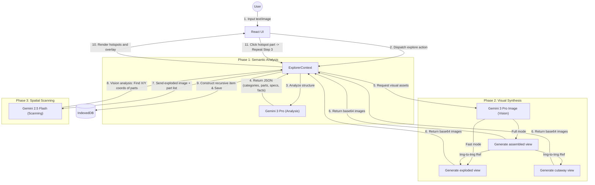

# Curious Explorer

**Curious Explorer** is a recursive visual encyclopedia powered by Google's Gemini models. It allows users to "explode" any physical object (or concept) into its constituent components, visualize them with technical precision, and recursively explore sub-parts infinitely.

It utilizes a complex multi-model AI pipeline to analyze text, generate technical schematics, and visually scan those generations to create interactive, clickable user interfaces on the fly.

## Features

*   **Recursive Exploration**: Click on any part of an object (e.g., "Engine" inside "Car") to generate a new deep-dive exploration of that specific part. The system uses context-aware prompting to maintain continuity (e.g., asking for "Seed" while inside "Avocado" generates "Avocado Seed").
*   **Multi-View Generation**:
    *   **Assembled**: The pristine, exterior look.
    *   **Cutaway**: A technical X-Ray cross-section.
    *   **Exploded**: A volumetric deconstruction showing all parts separated along a central axis.
*   **Interactive Tools**:
    *   **X-Ray Vision**: A draggable "Loupe" tool that reveals the internal Cutaway view beneath the Assembled exterior.
    *   **Smart Hotspots**: The system scans the generated image to find the exact coordinates of parts for interaction.
*   **Visual Customization**:
    *   **Styles**: Choose between *Default* (Semi-realistic), *Schematic* (Holographic blueprint), or *Drawing* (Technical sketch).
    *   **Modes**: *Full* (Generates all 3 views) or *Fast* (Generates only Exploded view for rapid navigation).
*   **Multimodal Input**:
    *   **Text**: Search for any object.
    *   **Image Upload**: Analyze an existing image to identify objects.
    *   **Camera**: Snap a photo of a real-world object to identify and explode it immediately.
*   **Data Persistence**:
    *   All explorations are saved locally to **IndexedDB**.
    *   **Export/Import**: Backup your knowledge graph to a JSON file.
    *   **Offline Mode**: Browse previously generated explorations without an internet connection.

## Tech Stack

*   **Frontend**: React 19, Vite, TypeScript
*   **Styling**: Tailwind CSS, Framer Motion (Animations)
*   **Storage**: IndexedDB (via native API)
*   **AI Models**:
    *   **Orchestration & Analysis**: `gemini-3-pro-preview` (Text/JSON)
    *   **Visual Synthesis**: `gemini-3-pro-image-preview` (Image Generation)
    *   **Computer Vision**: `gemini-2.5-flash` (Object Detection & Spatial Coordinate Mapping)

## Architecture

The application uses a "Identify-Analyze-Render-Scan" pipeline:



## Setup & Usage

1.  **Clone & Install**:
    ```bash
    npm install
    ```

2.  **Run Development Server**:
    ```bash
    npm run dev
    ```

3.  **API Key**:
    The app requires a Google Cloud API Key with access to the Gemini API.
    *   On first launch, click **USER KEY** to enter your key.
    *   Alternatively, use **OFFLINE MODE** to view cached data without generating new content.
